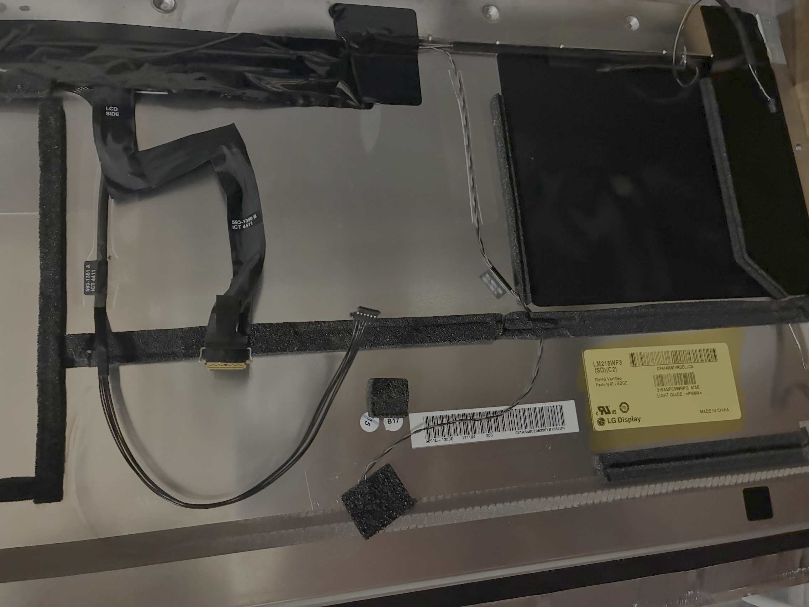
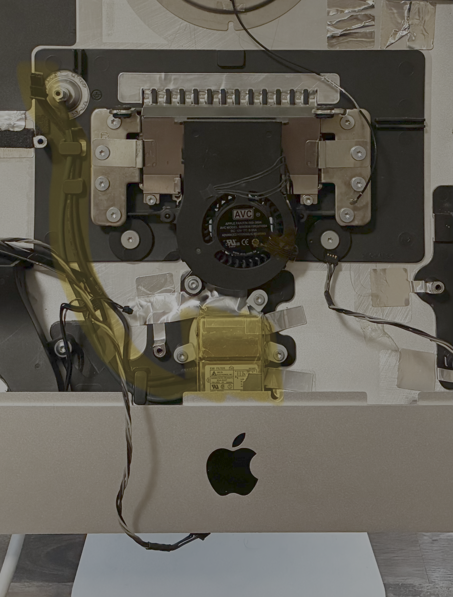
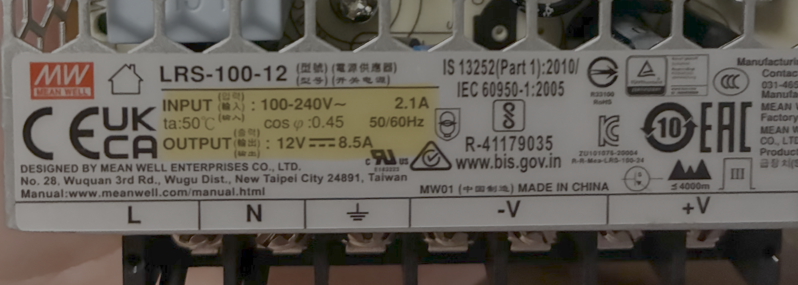
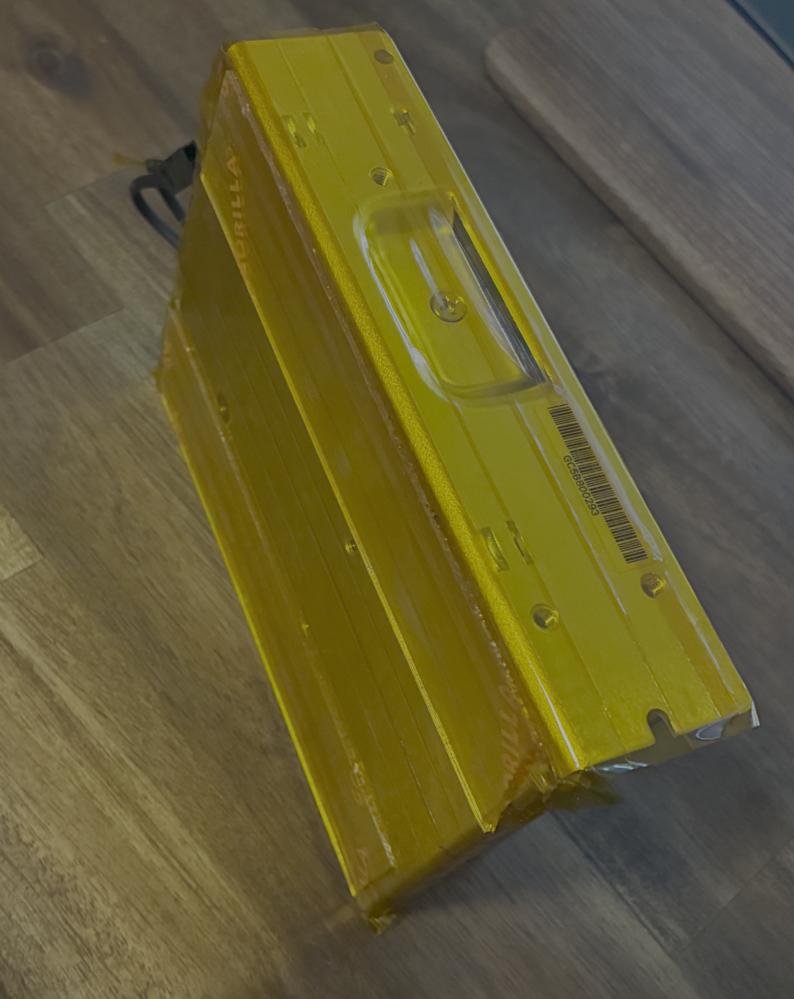

# 21.5" iMac to Monitor Conversion
Converting a 21.5" iMac that doesn't work anymore into an external monitor.

[TODO! image & caption for finished project]

**Read the guide before attempting anything**

## Teardown of the iMac
You can follow the instructions of iFixit's teardowns such as the [iMac Intel 21.5" EMC 2428 Mid
2011](https://www.ifixit.com/Teardown/iMac+Intel+21.5-Inch+EMC+2428+Teardown/5485) to learn how to
prepare the monitor, this teardown is the closest to the model that is used in this project which
is a 21.5" iMac 1311 which was released late 2009, mid 2010 and mid 2011.

*Teardown of the project, showing stock parts from the iMac that is going to be used in the
project*

### **Read this!**
The teardown is needed to find what type of panel is being used in the iMac so the approaiate HDMI
controller can be purchased. The sticker on the back of the panel will show this:

*The label will be on the back of the panel, you can search AliExpress for a HDMI controller that
will work to convert the panel over to an external display, information about the HDMI controller
will determine what hardware will be needed*

## Equipment, hardware & materials
### Equipment
- [Precision screwdriver kit](https://www.ifixit.com/en-au/products/mako-driver-kit-64-precision-bits)
- [Suction cups](https://www.ifixit.com/products/heavy-duty-suction-cups-pair)
- [Opening and prying kit](https://www.ifixit.com/en-au/products/prying-and-opening-tool-assortment)
- [Wire cutters](https://www.amazon.com.au/dp/B003EICAUS/?coliid=I1RJDNN308335&colid=14X3I2WPO7TMI&ref_=list_c_wl_lv_ov_lig_dp_it&th=1)
- [Wire strippers](https://www.amazon.com.au/dp/B09V1ZG2QB/?coliid=I3BA364UGTTKVA&colid=14X3I2WPO7TMI&psc=1&ref_=list_c_wl_lv_ov_lig_dp_it)

### Hardware
- [21.5" iMac 1311 LM215WF3-SDC2 HDMI Controller](https://www.aliexpress.com/item/1005005231652690.html?spm=a2g0o.order_list.order_list_main.53.7eea1802QVjeaj)
- [Speaker crossover for iMac 1311](https://www.aliexpress.com/item/1005012003234698.html?spm=a2g0o.order_list.order_list_main.47.7eea1802QVjeaj)
- [Meanwell LRS-100-12 Switching Power Supply](https://www.aliexpress.com/item/1005007287646072.html?spm=a2g0o.order_list.order_list_main.17.7eea1802QVjeaj)
- [Fan tempature controller DC 12V](https://www.aliexpress.com/item/1005007561332409.html?spm=a2g0o.order_list.order_list_main.5.7eea1802QVjeaj) 

### Materials
- Kapton tape
- Double sided tape
- [Insulated copper wire 4mm2](https://www.bunnings.com.au/deta-5m-1-5mm-earth-single-insulated-cable_p0760616?store=8199&gclsrc=aw.ds&gad_source=1&gad_campaignid=23536369919&gbraid=0AAAAADtbEB8QEOTxCLM00H_oIlhemE8ay&gclid=Cj0KCQjwlqTRBhCBARIsANrkrxjGDfaCJAvMGN44jW4C7daOmCjXGYtUSTPutc6Yl6-hUiGVq3aaDiAaAuKEEALw_wcB) 
- Electrical tape

## Salvaging iMac parts
### iMac stock power delivery
Keep the iMac's power cabling was important for athetic reasons, to achieve this the input power
delivery of 240V AC has to be converted to a desired DC output using a switching power supply.

*Trying to retain the power delivery will keep the outside asthetic of the project*

**Handling the power supply can be dangerous, BEWARE, the L and N stand for Live and Neutral, the
wires connected to the iMac power supply can be identifited by colour or you can use some kapton
tape to wrap and identify the live wire. Live is the colour brown and Neutral is the colour blue.
There is also lettering on the iMac's power supply that can identify each wire before snipping.**

The Meanwell LRS-100-12 Switching Power Supply can take an input range of 100-240V at 50/60 Hz from
a grid and output a 12V DC with 8.5A current, it's even displayed on the device:

*The specifications is based on the voltage needed for the HDMI and fan controller, as they require
12V DC supplied which is viewable in the AliExpress listings.*

**When performing this task make sure the correct wires are attached to the correct terminal**\n
The iMac's power supply has the connector for the iMac's power cable that needs to be salvaged:

*The power cable connector from the iMac's power supply are snipped from the PCB and stripped
enough for the bare wire to be wrapped around the terminal screw*

*Kapton tape was used to cover the metal to reduce contact with iMac chassis and doubled-sided tape
will be used to attach it*

An electrical earth needs to be added and attached to the metal case as grounding which will be
secured with electrical tape that can handle the temperature while also being attached to the
ground terminal of the switching power supply.

[TODO! image & caption of the final placement and connections of the switching power supply]

### iMac speakers

### iMac panel

### Future considerations
