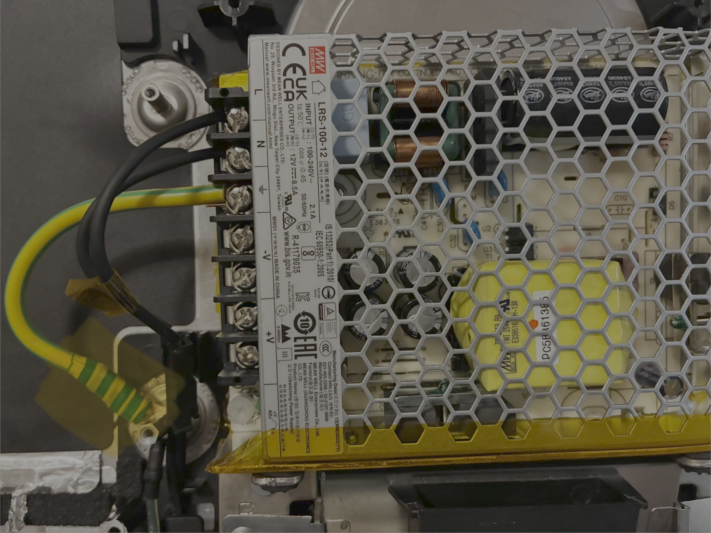
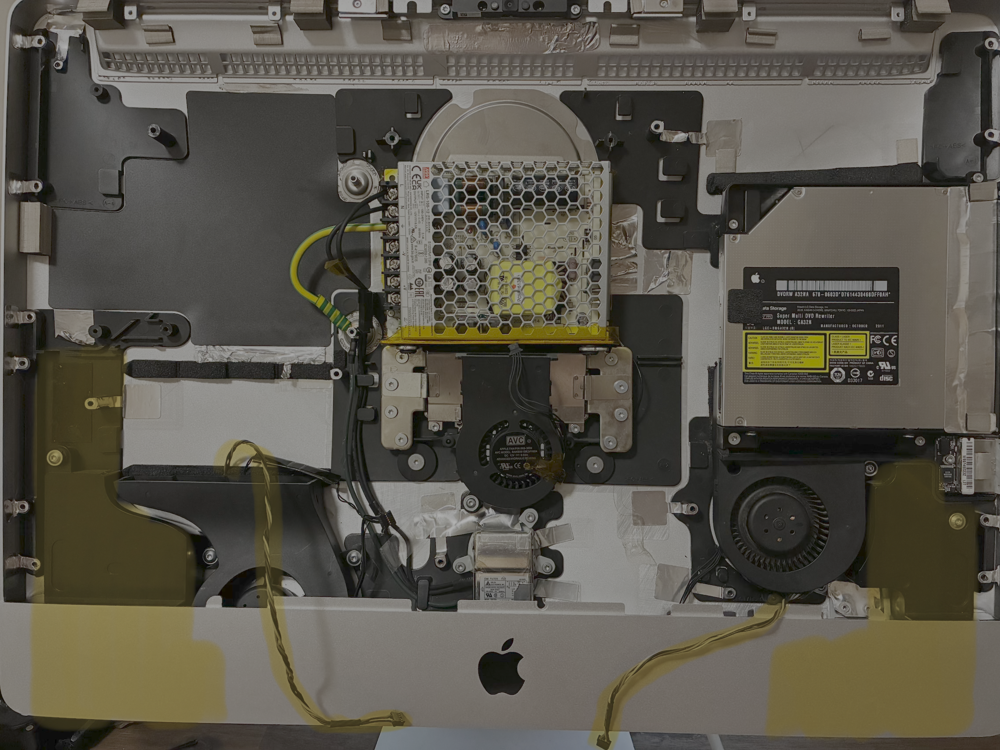

# 21.5" iMac to Monitor Conversion
Converting a 21.5" iMac that doesn't work anymore into an external monitor while keeping the
aesthetics and functionality intact.

[TODO! image & caption for finished project]

**Read the guide before attempting anything**

## Teardown of the iMac
You can follow the instructions of iFixit's teardowns such as the [iMac Intel 21.5" EMC 2428 Mid
2011](https://www.ifixit.com/Teardown/iMac+Intel+21.5-Inch+EMC+2428+Teardown/5485) to learn how to
prepare the monitor, this teardown is the closest to the model that is used in this project which
is a 21.5" iMac 1311 which was released late 2009, mid 2010 and mid 2011.

*After the teardown of the project was completed, OEM parts were decided to be kept based on
wanting to reuse as much as possible and keeping the aesthetic of the iMac's look. This includes
the power delivery cables, speakers, LCD panel, glass panel, chassis and possibly reusing the disc
drive and SD card slots.*

### **Read this!**
The teardown is needed to find what type of panel is being used in the iMac so the approaiate HDMI
controller can be purchased. The sticker on the back of the panel will show this:

*The label on the back of the panel has been highlighted in yellow, the image shows that the panel
regarding this project is an LG LM215WF3-SDC2. The information can be used to find a HDMI
controller board that will translate HDMI signal to the display panel.*

## Equipment, hardware & materials
### Equipment
- [Precision screwdriver kit](https://www.ifixit.com/en-au/products/mako-driver-kit-64-precision-bits)
- [Suction cups](https://www.ifixit.com/products/heavy-duty-suction-cups-pair)
- [Opening and prying kit](https://www.ifixit.com/en-au/products/prying-and-opening-tool-assortment)
- [Wire cutters](https://www.amazon.com.au/dp/B003EICAUS/?coliid=I1RJDNN308335&colid=14X3I2WPO7TMI&ref_=list_c_wl_lv_ov_lig_dp_it&th=1)
- [Wire strippers](https://www.amazon.com.au/dp/B09V1ZG2QB/?coliid=I3BA364UGTTKVA&colid=14X3I2WPO7TMI&psc=1&ref_=list_c_wl_lv_ov_lig_dp_it)
- Lighter

### Hardware
- [21.5" iMac 1311 LM215WF3-SDC2 HDMI Controller](https://www.aliexpress.com/item/1005005231652690.html?spm=a2g0o.order_list.order_list_main.53.7eea1802QVjeaj)
- [Speaker crossover for iMac 1311](https://www.aliexpress.com/item/1005012003234698.html?spm=a2g0o.order_list.order_list_main.47.7eea1802QVjeaj)
- [Meanwell LRS-100-12 Switching Power Supply](https://www.aliexpress.com/item/1005007287646072.html?spm=a2g0o.order_list.order_list_main.17.7eea1802QVjeaj)
- [Fan tempature controller DC 12V](https://www.aliexpress.com/item/1005007561332409.html?spm=a2g0o.order_list.order_list_main.5.7eea1802QVjeaj) 

### Materials
- [Kapton tape](https://www.aliexpress.com/item/1005009367219178.html?spm=a2g0o.productlist.main.3.17e84d98jYvfKA&algo_pvid=f11cb6c5-8341-429b-a43c-a35fa21622ba&algo_exp_id=f11cb6c5-8341-429b-a43c-a35fa21622ba-2&pdp_ext_f=%7B%22order%22%3A%222796%22%2C%22eval%22%3A%221%22%2C%22fromPage%22%3A%22search%22%7D&pdp_npi=6%40dis%21AUD%211.95%211.43%21%21%219.14%216.71%21%40212a70c017812238077061917edcf2%2112000048881902003%21sea%21AU%212036447517%21X%211%210%21n_tag%3A-29919%3Bd%3Af39deec3%3Bm03_new_user%3A-29895%3BpisId%3A5000000204064227&curPageLogUid=8gEvphh1z5VF&utparam-url=scene%3Asearch%7Cquery_from%3A%7Cx_object_id%3A1005009367219178%7C_p_origin_prod%3A)
- [Double-sided tape](https://www.bunnings.com.au/gorilla-7-3m-double-sided-tape_p0519511?store=8103&gclsrc=aw.ds&gad_source=1&gad_campaignid=21119565770&gbraid=0AAAAADtbEB-bar5evElgqQ2rjHNEVwPaH&gclid=CjwKCAjwuanRBhBSEiwAY5y6V8epGSIJBjDJhqKeEj5swscHt5Pk400f6E2DYI7jAQPn0mkrs1Ce7xoC5oMQAvD_BwE)
- [Insulated copper wire 4mm2](https://www.bunnings.com.au/deta-5m-1-5mm-earth-single-insulated-cable_p0760616?store=8199&gclsrc=aw.ds&gad_source=1&gad_campaignid=23536369919&gbraid=0AAAAADtbEB8QEOTxCLM00H_oIlhemE8ay&gclid=Cj0KCQjwlqTRBhCBARIsANrkrxjGDfaCJAvMGN44jW4C7daOmCjXGYtUSTPutc6Yl6-hUiGVq3aaDiAaAuKEEALw_wcB) 
- [Copper terminal lugs](https://www.aliexpress.com/item/1005010433751584.html?spm=a2g0o.order_list.order_list_main.41.4b5f1802dJMRkG)
- [Electical Heat-shrink tubes](https://www.aliexpress.com/item/1005010440409440.html?spm=a2g0o.order_list.order_list_main.11.4b5f1802dJMRkG)

## Salvaging OEM parts
### OEM power cabling
Keeping the OEM power cabling was important as other projects will remove sections of the chassis
to help with cabling, this project is based on the aesthetic of the iMac so salvaging the OEM power
delivery cables was the reason for this decision.

The solution is to use a switching power supply that will convert the power coming from mains into
the needed voltage (V) and current (A) to drive the HDMI controller board as well as any of boards 
that will reuse the OEM parts that are to be salvaged in the project.

*The location of the OEM power cables is highlighted in yellow, it shows that mains has been split 
into 2 sections with the live and neutral wire attached to a connector and the ground wire has a 
terminal end attached that has been secured to the chassis's earthing lug inside the iMac.*

The switching power supply chosen was the Meanwell LRS-100-12, it was chosen because the HDMI
controller board requires 12V DC input for power as well as the fan controller also needs the same
12V DC.

*Label of the Meanwell LRS-100-12 with the speciciations highlighted in yellow which says that the
switching power supply can take an input range of 100-240V at a frequency of 50/60 Hz from the
grid and will output 12V DC with 8.5A current.*

**When performing this next task make sure the correct wires are attached to the correct terminal,
handling the power supply is dangerous, TAKE NOTICE, the live (L) and neutral (N) wire connector
needs to be snipped, stripped and attached to the switching power supply correctly. Wrap kapton
tape around the live wire before snipping.**

The iMac's power supply has the connector for the iMac's power cable that needs to be salvaged:

*The power cable connector from the iMac's power supply are snipped from the PCB and stripped
enough for the bare wire to be wrapped around the terminal screw which secures the live and neutral
terminals on the Meanwell LRS-100-12, this will deliver mains power to the switching power supply.*

*Kapton tape was used to cover the metal to reduce contact to the metal of the chassis and doubled-sided 
tape will be used to securely attach the switching power supply to the chassis in a location that
will not impact the display panel.*

An electrical earth needs to be added and attached to same earth lug as grounding which will be
secured with terminal end that can handle the temperature of mains ampere while also being attached 
to the ground terminal of the switching power supply.

*Final placement of the Meanwell LRS-100-12 being attached to the chassis using the double-sided
above the hinge as it has the best height allowance in which the switching power supply will not
hinder the display panel, you could add kapton tape to the top corner if you want reduce possible
metals touching.*

*Reminder to wrap the terminal end which can be done using appropriately size heatshrink electrical
tube and using a lighter to shrink the tube to the wire and exposed copper.*

### OEM speakers
Keeping the OEM speakers was a decision based on the fact that the HDMI controller board could
support this and the installation of a speaker crossover boards for each OEM speaker can achieve 
this.

*The speakers sit internally within the covered section, the highlights show where the speakers sit
as well as the cords that connect to the speaker.*

*The HDMI controller has a connector for the crossober speaker board as well as connectors for the
OEM speakers to connect into based on the sizes of each speaker connector.*

*The bottom of the crossover speaker boards were taped with kapton to stop any of the through hole
soldered circuitry on the bottom of the board from short circuiting by touching metal as well as 
double-sided tape to secure the board to the chassis.*

*Each speaker side has a different size connector which will match one of the sizes on the
crossover speaker board, I have also attached the connection between the crossover speaker board to
the HDMI controller based on the diagrams.*

*The installation of the speaker crossover boards attached to chassis in ideal positions close to
each OEM speaker along with the connector for the HDMI controller board taped to keep neat wire
positions.*

### OEM panel

### OEM fans

### Future considerations
